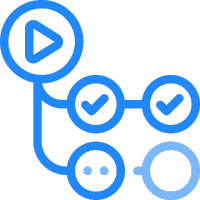
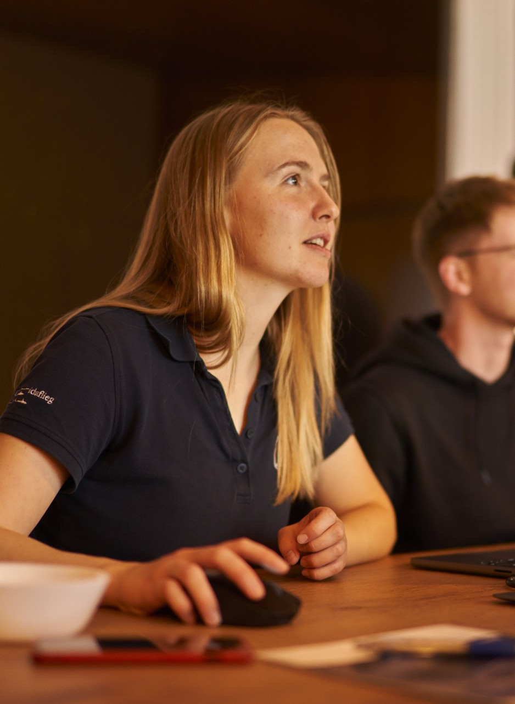
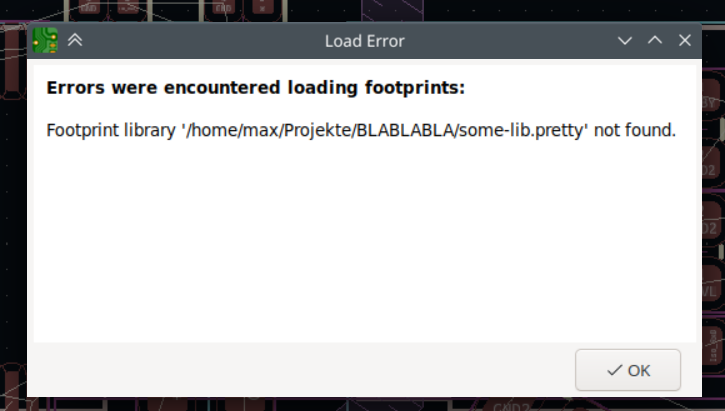
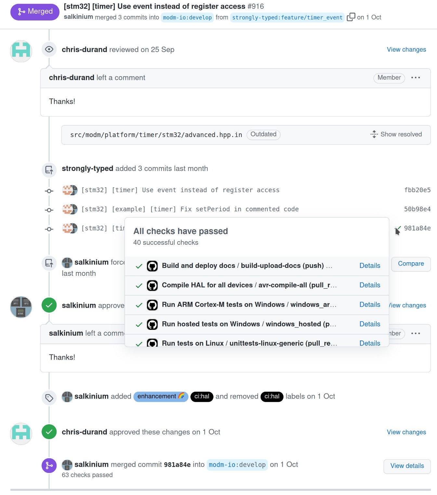
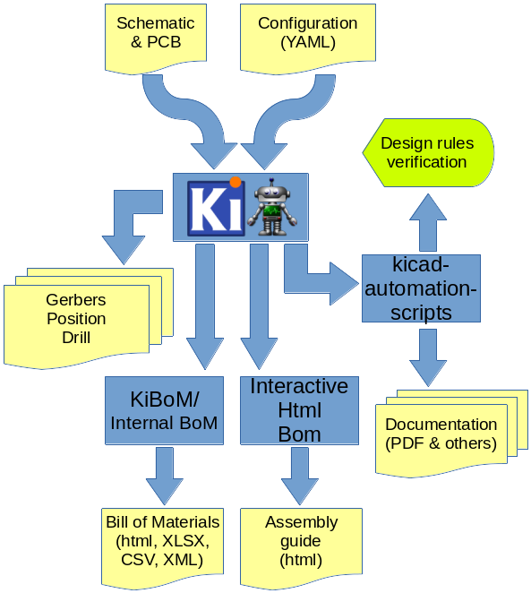
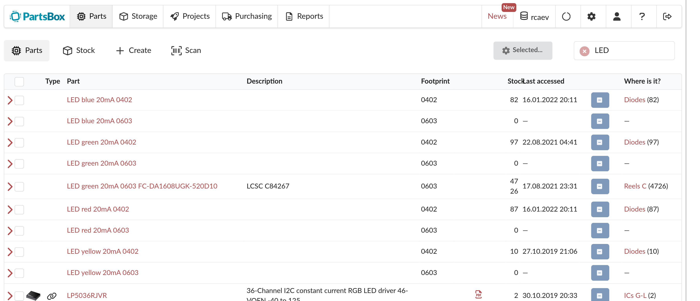
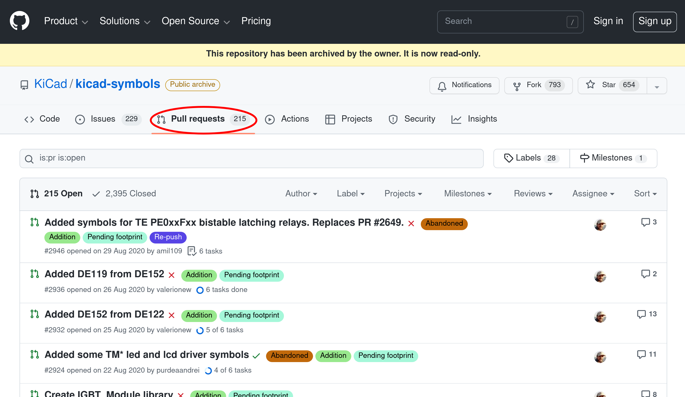
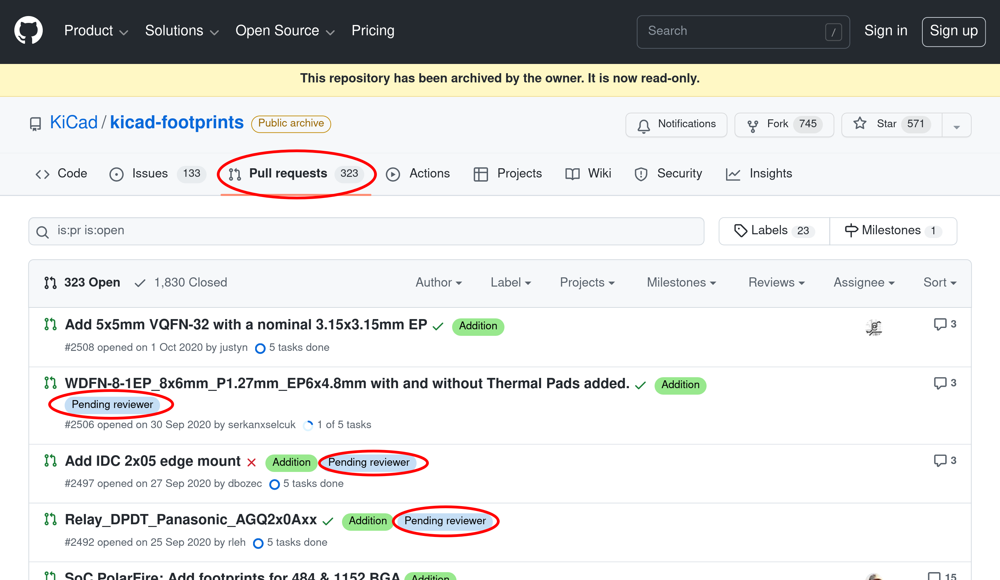
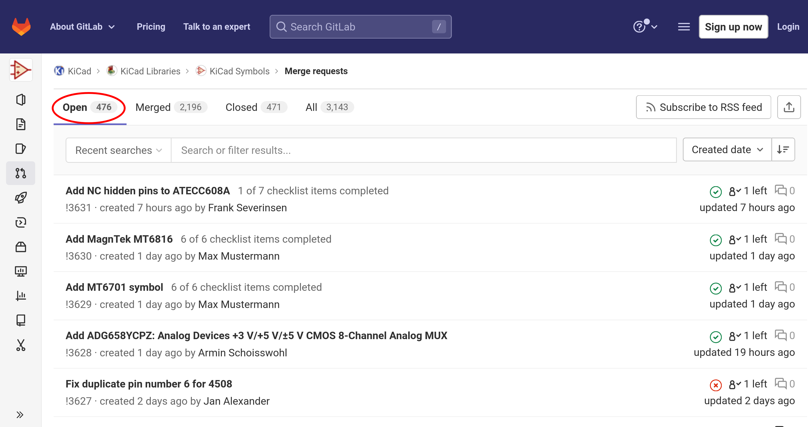
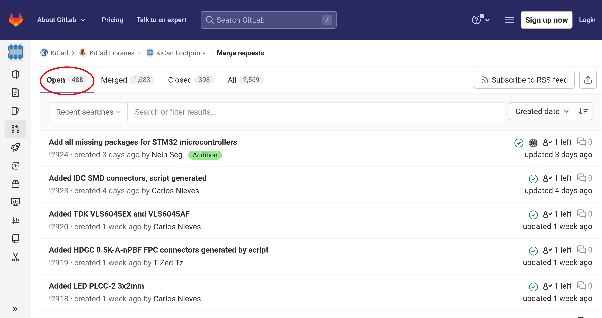

<style>
img[alt~="center"] {
  display: block;
  margin: 0 auto;
}
</style>



# Continuous Integration mit KiCad

### _Oder auch:_ Dumme Fehler und nerviges Aufgaben vermeiden
### _Oder auch:_ Automatisierte Hilfe beim PCB-Review

---


# Über mich

**Raphael Lehmann**

👩‍🎓 _Elektrotechnik, Informationstechnik & technische Informatik_ @ RWTH Aachen

💌 raphael@rleh.de

🦜 [@rleh_de](https://twitter.com/rleh_de)

🤖 [Roboterclub Aachen e.V.](https://www.roboterclub.rwth-aachen.de/)

💫 [TechAachen e.V.](https://techaachen.de/)

---

<!-- class: invert -->



## PCB Design Prozess

1. ✏️ Schaltplan
2. 👀 Review
3. ✍️ Layout
4. 👀 Review
5. 🩹 Anmerkungen aus Reviews umsetzen
6. Fertigungsdaten vorbereiten
7. 💥 Fehler in Fertigungsdaten oder Bauteile nicht lieferbar
8. 🔁 Iterieren
9. 🔁 ...
10. 💾 Projekt archivieren

---

## Wer kennt es nicht?

- Unterschiedliche Titel, Revision, Datum auf verschiedenen Schaltplanseiten
- Uneindeutige Bezeichnungen
- (Weitere nervige Review-Probleme ...)
- DRC-Check Fehler



---

# Github Actions



- Skripte bei Events (Push, Pull Request, Merge, ...) ausführen
- Umgebung: Docker
  [`docker run ghcr.io/rleh/kicad6_and_pandoc:latest`](https://github.com/rleh/docker-kicad-pandoc)
- ...

---



# KiBot 

https://github.com/INTI-CMNB/KiBot

- 🚧 Under development, aber funktioniert gut!
- Enthalten im docker image `ghcr.io/rleh/kicad6_and_pandoc`
- Nutzt coole KiCad plugins
  - [🔗](https://github.com/openscopeproject/InteractiveHtmlBom) Interactive HTML BOM
  - [🔗](https://github.com/SchrodingersGat/KiBoM) KiBoM

---
<!-- _class: non-inverted -->

# 👩‍🍳🍳 `.github/workflows/kicad.yml`

```yaml
name: "Kicad Checks"

on:
  push:

jobs:
  kicad_checks:
    runs-on: ubuntu-latest
    container: ghcr.io/rleh/kicad6_and_pandoc:latest

# ...
```

---
<!-- _class: non-inverted -->

# 👩‍🍳🍳 Vorbereitungen

```yaml
- name: Identify changed KiCad projects (compared to main)
  run: |
    echo PROJECTS=$(git diff --diff-filter=ACMRT \
    --name-only origin/main... | grep "pcbs/" | grep -v "pcbs/lib" | \
    cut -d/ -f2 | uniq) >> $GITHUB_ENV

- name: Exclude projects without KiBot file
  shell: bash
  run: |
    FILTERED_PROJECTS=()
    for P in $PROJECTS; do
      if [[ -f "pcbs/$P/config.kibot.yaml" ]]; then
        # This project has a valid KiBot file and will be checked
        FILTERED_PROJECTS+=($P)
      fi
    done
    echo PROJECTS=$(echo ${FILTERED_PROJECTS[@]}) >> $GITHUB_ENV
    echo PROJECT_COUNT=$(echo ${#FILTERED_PROJECTS[@]}) >> $GITHUB_ENV
```

---
<!-- _class: non-inverted -->

# 🍜 Revisionsvergleich

```yaml
- name: Check revision numbers identical
  if: env.PROJECT_COUNT >= 1
  run: |
    for P in $PROJECTS
    do
      (cd pcbs/$P && ../../.github/res/kicad_revision_check.sh)
    done
```

---
<!-- _class: non-inverted -->

# 🧙 `kicad_revision_check.sh`

```bash
#!/bin/bash
return_code=0

echo "All revision strings have to be identical. Checking..."
n=$(grep -hR "^    (rev" | cut -c 11- | rev | cut -c 3- | rev | uniq | wc -l)
if [ $n -ne 1 ]; then
    echo "ERROR: Multiple different revision strings detected ($n)"
    ((return_code+=10))
fi

# ...

exit $return_code

```

---
<!-- _class: non-inverted -->


```yaml
- name: Print schematic
  if: env.PROJECT_COUNT >= 1
  run: |
    for P in $PROJECTS
    do
      echo $P
      (cd pcbs/$P && kibot -v --skip-pre all print_sch)
    done

- name: Gerber export
  if: env.PROJECT_COUNT >= 1
  run: |
    for P in $PROJECTS
    do
      (cd pcbs/$P && kibot -v --skip-pre all gerbers gerber_drills)
      (cd pcbs/$P/gerber && zip ../gerber.zip *)
    done
```

---


## Bauteil-Matching 🧩
- Automatisiert Bauteile mit Bauteildatenbank matchen
  -  PartKeepr oder  PartsBox
- Heuristik für Standard-Bauteile (Widerstände, Kondensatoren, LEDs, ...)
- String-Matching mit MPN im Value-Feld
- Report als PDF/HTML/Markdown generieren
- CI Durchlauf nach Merge: BOM in Bauteildatenbank anlegen

---

## Bauteil-Matching
<!-- _class: non-inverted -->

KiCad Python-Scripting 🔥

```python
#!/usr/bin/env python3
import pcbnew

filename = "test.kicad_pcb"
board: pcbnew.BOARD = pcbnew.LoadBoard(filename)

components = board.GetFootprints()
rev = str(board.GetTitleBlock().GetRevision())

# ...
```
---

## Bauteildatenbank



Wichtig: Einheitliche Konvention für Bauteilbezeichnungen
Z.B.: `LED {color} {current rating} {package}`

---
<!-- _class: non-inverted -->

🔥🔥🔥

```python
for c im components:
  reference = str(c.GetReference())
  value = str(c.GetValue())
  footprint = str(c.GetFPID().GetLibItemName())
  package = re.search(r"(?P<package>0402|0603|0805|1206)", footprint)
  if package is not None:
    package = package.group("package")

  # ...

  if "LED" in c.footprint:
    color = re.search(r"(?P<color>red|green|blue|yellow|orange)", value.lower())
    if package and color:
      color = color.group("color")
      return partsbox_search_by_name(f"LED {color} 20mA {package}")
  if re.search(r'C\d+', reference):
    # ...
  # ...
  else:
    # fallthrough case: MPN specified in value field
    return partsbox_search_by_name(value)
    
# ...
```


---

# Vielen Dank für eure Aufmerksamkeit!

### Fragen?

---

# Backup

---

## KiCad Libraries
- 🥇 Qualitätsstandard übertrifft kommerzielle Bibliotheken um Größenordnungen
- Aktuell ≥ 900 offene Merge-Requests für Symbole und Footprints 📚
- 👎 Wechsel vom Github zu Gitlab am 01.10.2020
  ➜ ≥ 500 Pull-Requests faktisch beerdigt

#### Review-Prozess
- 👥 Zu wenig Reviewer
- Viel manueller Aufwand ⚙️
  ➜ Mehr Automatisierung

**Wie können wir das langfristig besser machen? 🤔**

---



---



---



---



---

# 💡 Idee: KiCad Library Hackathon

🔧 Tooling verbessern
👶 KiCad Nutzer als Library-Maintainer gewinnen
📚 Backlog an offenen PRs mit Symbolen und Footprints abarbeiten
🌍 An mehreren Orten?

---

# Ende 🏁
